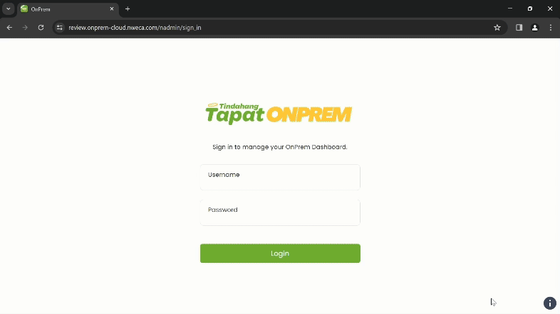
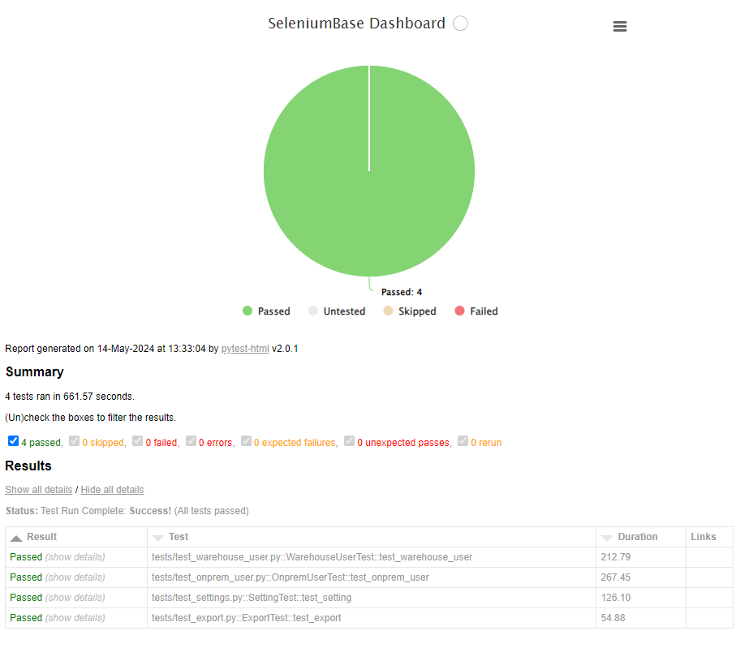

## Description
SeleniumBase is a Python framework that simplifies web test automation by building on Selenium WebDriver. It provides an intuitive syntax and powerful features for browser actions, element validation, and integration with test runners like pytest, making it easier to create and maintain automated functional tests.

## Set Up Python & Git:
<a href="https://pypi.org/project/seleniumbase/" target="_blank"></a>

Before you can start writing automated tests with SeleniumBase, you need to set up your environment. Follow these steps:

1. **Install Python and Git**: Ensure both are installed and added to your system PATH.
   - [Install Python](https://www.python.org/downloads/)
   - [Install Git](https://git-scm.com/downloads)

2. **Virtual Environment**: Using a Python virtual env is recommended.

3. **Install SeleniumBase**: You can install SeleniumBase using pip, the Python package manager:
    ```sh
    pip install seleniumbase
    ```
    **How to install ``seleniumbase`` from a GitHub clone:**

    ```bash
    git clone https://github.com/seleniumbase/SeleniumBase.git
    cd SeleniumBase/
    pip install -e .
    ```

## Writing Tests
🔵 Once you have set up your environment, you can start writing tests using SeleniumBase. Here's a simple example:

```python
from seleniumbase import BaseCase

class LoginPage(BaseCase):

    def login(self):
        # Open the login page
        self.open("https://onprem.nweca.com")
        self.maximize_window()
        self.type("input[type='username']", "username")
        self.type("input[type='password']", "password")
        self.click('input[type="submit"]')
        self.assert_url("https://onprem.nweca.com/dashboard")
```

## Running Tests
🔵 To run your tests, you can use the following command in your terminal:

```sh
pytest my_test_case.py
```

Make sure to replace `my_test_case.py` with the name of your test file.

## Demo Mode
🔵 <b>Demo Mode</b> allows you to see test actions more clearly by pausing between steps, highlighting interacted elements, and displaying assertions, making it easier to follow fast-running tests.
To run tests in verbose mode and with demo mode (showing browser actions), use:

Here's <a href="https://github.com/jmsdaq/seleniumbase-functional-testing/blob/main/tests/test_export.py">test_export.py</a>




```sh
cd tests/
pytest my_test_case --demo
```


🔵 ``time.sleep(seconds)`` can be used to make a test wait at a specific spot:

```python
import time; time.sleep(3)  # Do nothing for 3 seconds.
```

## Directory Structure
 

```bash
seleniumbase/                        
│
├── data
│   └── avatar.jpg 
│
├── latest_logs                 # Logs from the latest test runs
│   ├── basic_test_info.txt 
│   ├── page_source.html  
│   └── screenshot.png 
│
├── tests/                      # Directory for test cases
│   ├── assets/
│   │    ├── live.js
│   │    ├── pytest_style.css 
│   │    ├── style.css 
│   │    └── WarehouseTest.png 
│   │
│   ├── __init__.py
│   └── tests/
│      ├── __init__.py
│      ├── dashboard.html  
│      ├── report.html  
│      ├── test_export.py 
│      ├── test_onprem_user.py
│      ├── test_settings.py
│      └── test_warehouse.py
│
├── page_objects/               # Page object model (POM) files
│   ├── __init__.py
│   ├── export.py  
│   ├── login.py
│   ├── setting.py
│   └── user.py
│
├── requirements.txt            # Dependencies
├── pytest.ini                  # Pytest configuration
└── setup.cfg                   # Project setup configuration
```

🔵 When running tests with **``pytest``**, you'll want a copy of **[pytest.ini](https://github.com/jmsdaq/seleniumbase-functional-testing/blob/main/pytest.ini)** in your root folders. When running tests with **``pynose``**, you'll want a copy of **[setup.cfg](https://github.com/jmsdaq/seleniumbase-functional-testing/blob/main/setup.cfg)** in your root folders. These files specify default configuration details for tests. Test folders should also include a blank **[__init__.py](https://github.com/jmsdaq/seleniumbase-functional-testing/blob/main/tests/__init__.py)** file to allow your test files to import other files from that folder.

## SeleniumBase Dashboard and Test Reports:

🔵 The ``--dashboard`` option for pytest generates a SeleniumBase Dashboard located at ``dashboard.html``, which updates automatically as tests run and produce results. Example:

```bash
pytest --dashboard --rs --headless
```

🔵 <code>pytest</code> HTML Reports:

Using ``--html=report.html`` gives you a fancy report of the name specified after your test suite completes.

When combining pytest html reports with SeleniumBase Dashboard usage, the pie chart from the Dashboard will get added to the html report. Additionally, if you set the html report URL to be the same as the Dashboard URL when also using the dashboard, (example: ``--dashboard --html=dashboard.html``), then the Dashboard will become an advanced html report when all the tests complete.

🔵 Here's an example of an upgraded html report:

```bash
pytest test_suite.py --dashboard --html=report.html
```



## Troubleshooting
If you encounter any issues, check the following:
- Ensure all dependencies are installed correctly.
- Consult the SeleniumBase documentation for more details: [SeleniumBase Documentation](https://seleniumbase.io).

## Contributing
If you would like to contribute to this project, please fork the repository and submit a pull request. For major changes, please open an issue first to discuss what you would like to change.
